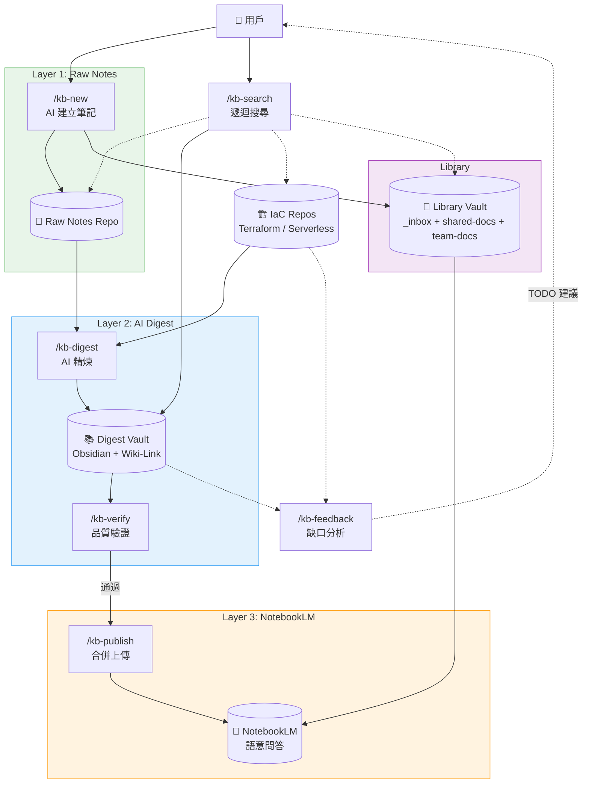

```mermaid
flowchart TB
    A["👤 用戶"]

    subgraph input["Layer 1: Raw Notes"]
        KB_NEW["/kb-new<br/>AI 建立筆記"]
        RAW[("📝 Raw Notes Repo")]
    end

    subgraph digest["Layer 2: AI Digest"]
        KB_DIGEST["/kb-digest<br/>AI 精煉"]
        VAULT[("📚 Digest Vault<br/>Obsidian + Wiki-Link")]
        KB_VERIFY["/kb-verify<br/>品質驗證"]
    end

    subgraph output["Layer 3: NotebookLM"]
        KB_PUBLISH["/kb-publish<br/>合併上傳"]
        NLM[("🤖 NotebookLM<br/>語意問答")]
    end

    subgraph library["Library"]
        LIB[("📖 Library Vault<br/>_inbox + shared-docs + team-docs")]
    end

    KB_FEEDBACK["/kb-feedback<br/>缺口分析"]
    KB_SEARCH["/kb-search<br/>遞迴搜尋"]
    IAC[("🏗️ IaC Repos<br/>Terraform / Serverless")]

    A --> KB_NEW
    KB_NEW --> RAW
    RAW --> KB_DIGEST
    IAC --> KB_DIGEST
    KB_DIGEST --> VAULT
    VAULT --> KB_VERIFY
    KB_VERIFY --> |通過| KB_PUBLISH
    KB_PUBLISH --> NLM

    VAULT -.-> KB_FEEDBACK
    IAC -.-> KB_FEEDBACK
    KB_FEEDBACK -.-> |TODO 建議| A

    KB_NEW --> LIB
    LIB --> NLM

    A --> KB_SEARCH
    KB_SEARCH --> VAULT
    KB_SEARCH -.-> RAW
    KB_SEARCH -.-> IAC
    KB_SEARCH -.-> LIB

    style input fill:#e8f5e9,stroke:#4caf50
    style digest fill:#e3f2fd,stroke:#2196f3
    style output fill:#fff3e0,stroke:#ff9800
    style library fill:#f3e5f5,stroke:#9c27b0
```
